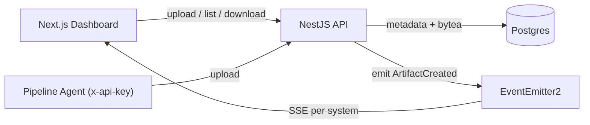

# Pit Artifacts Management

A first-iteration backend (plus dashboard) for storing, versioning, and serving
pipeline artifacts. Built with **NestJS + TypeScript**, **PostgreSQL**, and a
**Next.js** dashboard. Clients are notified of new artifacts in real time via
**Server-Sent Events (SSE)**.

```
Customer ──< System ──< Artifact (binary content + metadata, versioned)
```

## Features

- Upload an artifact to a system (multipart upload, no processing).
- List all artifacts for a system (metadata only).
- Download an artifact's content.
- Live notifications to connected browsers when a new artifact appears (SSE as required we can scale for each logged-in user).
- Pre-seeded `Customer -> System` hierarchy with read endpoints.
- API-key protection on write endpoints.
- Persistence across restarts (Postgres + named Docker volume).

## Tech Stack & Architecture

| Layer        | Choice                                             |
| ------------ | -------------------------------------------------- |
| API          | NestJS (controllers -> services -> repositories)   |
| Persistence  | PostgreSQL via TypeORM (migrations, no `synchronize`) |
| Realtime     | SSE through a NestJS `@Sse` endpoint + `EventEmitter2` |
| Frontend     | Next.js App Router (TypeScript)                    |
| Orchestration| Docker Compose                                     |

The backend is organized **by technical responsibility** (role-based layering):
all controllers live together, all services together, all entities together, and
so on. The request flow is controller -> service -> repository -> entity.

```
backend/src/
  controllers/    # HTTP/SSE entry points (artifacts, systems, notifications, health)
  services/       # business logic (+ co-located *.spec.ts unit tests)
  repositories/   # data access (TypeORM queries)
  entities/       # database models (customer, system, artifact)
  dto/            # request/response shapes
  events/         # domain event names + payload types
  guards/         # API-key guard
  filters/        # global exception filter
  modules/        # NestJS module wiring (one per feature area)
  config/         # env configuration
  database/       # data-source, migrations, seeds
```



## Running with Docker Compose

Requirements: Docker + Docker Compose.

```bash
# from the repo root
docker compose up --build
```

This starts three services:

| Service   | URL                          | Notes                                |
| --------- | ---------------------------- | ------------------------------------ |
| frontend  | http://localhost:3000        | Pit dashboard                        |
| backend   | http://localhost:4000        | Artifacts API                        |
| postgres  | localhost:5436              | Data persisted in the `pgdata` volume |

On startup the backend automatically **runs migrations** and **seeds** the
`Customer -> System` hierarchy (idempotent). Open the dashboard, pick a system,
upload a file, and watch it appear live (open a second tab to see SSE push the
update to the other tab).

To customize, copy `.env.example` to `.env` and adjust values before
`docker compose up --build`.

```bash
cp .env.example .env
```

To stop and wipe data:

```bash
docker compose down -v
```

## API Reference

Base URL: `http://localhost:4000`. Write endpoints require the
`x-api-key` header (default `dev-internal-api-key`).

Interactive **Swagger UI** is available at
[http://localhost:4000/docs](http://localhost:4000/docs) (raw OpenAPI JSON at
`/docs-json`). Use the **Authorize** button to set your `x-api-key` and try the
upload endpoint directly from the browser.

| Method | Path                              | Auth     | Description                       |
| ------ | --------------------------------- | -------- | -------------------------------- |
| GET    | `/`                               | –        | Health check: API + DB (503 if DB down) |
| GET    | `/systems`                        | –        | List systems (with customer)     |
| GET    | `/systems/:systemId`              | –        | Get a single system              |
| POST   | `/systems/:systemId/artifacts`    | API key  | Upload an artifact (multipart)   |
| GET    | `/systems/:systemId/artifacts`    | –        | List artifact metadata           |
| GET    | `/artifacts/:id/download`         | –        | Download artifact content        |
| GET    | `/systems/:systemId/events`       | –        | SSE stream of new-artifact events |

### Example: find a system, upload, list, download

```bash
# 1. Grab a seeded system id
SYSTEM_ID=$(curl -s http://localhost:4000/systems | python3 -c "import sys,json;print(json.load(sys.stdin)[0]['id'])")

# 2. Upload an artifact (logical name optional; defaults to filename)
curl -s -X POST "http://localhost:4000/systems/$SYSTEM_ID/artifacts" \
  -H "x-api-key: dev-internal-api-key" \
  -F "file=@./schema.sql" \
  -F "name=schema.sql"

# 3. List artifacts
curl -s "http://localhost:4000/systems/$SYSTEM_ID/artifacts"

# 4. Download (replace ARTIFACT_ID)
curl -s "http://localhost:4000/artifacts/ARTIFACT_ID/download" -o downloaded.sql

# 5. Subscribe to live events (leave running, then upload in another shell)
curl -N "http://localhost:4000/systems/$SYSTEM_ID/events"
```

Uploading the same logical `name` again creates a new **version** (v1, v2, …);
all versions are retained.

## Local Development (without Docker)

```bash
# Start only Postgres
docker compose up -d postgres

# Backend
cd backend
cp .env.example .env        # defaults target localhost Postgres
npm install
npm run migration:run
npm run seed
npm run start:dev           # http://localhost:4000

# Frontend (new shell)
cd frontend
cp .env.example .env
npm install
npm run dev                 # http://localhost:3000
```

## Testing

```bash
cd backend
npm test          # unit tests (ArtifactsService: versioning, checksum, errors)
npm run test:e2e  # upload -> list -> download happy path (needs Postgres running)
```

The e2e test expects a reachable Postgres using the same env defaults; start it
with `docker compose up -d postgres` first.

## Configuration

Backend (`backend/.env`):

| Variable        | Default                 | Description                          |
| --------------- | ----------------------- | ------------------------------------ |
| `PORT`          | `4000`                  | API port                             |
| `API_KEY`       | `dev-internal-api-key`  | Shared secret for write endpoints    |
| `CORS_ORIGIN`   | `*` (compose: dashboard)| Allowed CORS origin                  |
| `MAX_UPLOAD_MB` | `25`                    | Max upload size                      |
| `DB_*`          | see file                | Postgres connection                  |

Frontend (`frontend/.env`):

| Variable               | Default                 | Description                       |
| ---------------------- | ----------------------- | --------------------------------- |
| `NEXT_PUBLIC_API_URL`  | `http://localhost:4000` | Backend URL as seen by the browser |
| `NEXT_PUBLIC_API_KEY`  | `dev-internal-api-key`  | Demo-only key for the upload form  |

## Assumptions

- **Hierarchy is pre-seeded.** Customers/systems are created by a seed script
  and exposed via read endpoints. Managing them (CRUD) is out of scope for this
  iteration; the API is shaped so it can be added later.
- **No file processing.** Content is stored as-is, as required.
- **Versioning** is per `(systemId, logical name)` and auto-incremented on
  upload. A unique index `(system_id, name, version)` enforces integrity; the
  service retries on the rare read-then-write race.
- **Single instance.** The SSE event bus is in-process (see trade-offs).
- **Authn over authz.** A single shared API key gates writes; reads/SSE are open
  for demo simplicity.

## Key Trade-offs (and what I'd do next)

- **Binary in Postgres (`bytea`) vs object storage.** Chosen for simplicity and
  to keep "persist across restarts" to a single dependency. Given the content is
  sensitive and potentially large, the production choice is **S3/MinIO with
  server-side encryption**, storing only a reference + checksum in Postgres. The
  data-access layer is isolated in `ArtifactsRepository`, so swapping the storage
  backend is localized. The `bytea` column is `select: false` so list/metadata
  queries never load content.
- **SSE vs WebSockets.** SSE is the lightest fit for a one-way
  "new artifact available" signal: native `EventSource`, auto-reconnect, plain
  HTTP. WebSockets would be warranted once bidirectional/interactive features
  appear.
- **In-process event bus vs Redis pub/sub.** `EventEmitter2` works for a single
  instance. For horizontal scaling, SSE fan-out must be backed by **Redis
  pub/sub** (or similar) so an upload on one node reaches subscribers on another.
- **API key vs full auth.** A shared secret is a deliberate shortcut. Production
  needs proper **OAuth2/OIDC + RBAC** (per-customer scoping so a client only sees
  its own systems/artifacts), and the browser should not hold an internal key —
  dashboard uploads should go through a session-authenticated backend-for-frontend.
- **Versioning race.** Version numbers are computed read-then-write with a unique
  constraint + retry. A cleaner approach is a per-`(system,name)` sequence or an
  `INSERT ... SELECT max+1` in one statement; acceptable at this scale.

## Things intentionally left out (time-boxed)

- Pagination/filtering on artifact listing.
- Auth beyond the shared key; per-customer authorization.
- Object storage + encryption at rest.
- Soft deletes / retention policies.
- Rich observability (metrics, tracing); only structured logs are present.
